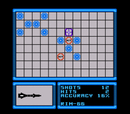

## BattleShips

## 1. Team and Title Details:
	Game Title: `BattleShips`

-	Name: `Dan Gerchcovich`
	ID: `1750291`
	GitHub user name: `TheArchitect123`

-	Name: `Clancy Light Townsend`
	ID: `9715290`
	GitHub user name: `ClancyLight`

-	Name: `Zane Henderson`
	ID: `100498430`
	GitHub user name: `zanehenderson`

## 2.
##Overview:
BattleShips is a game that involves two players guessing and predicting each other's ships' positions on the board. They player has a single turn to guess the opponent's positions, and if he predicts the correct position then he gets another turn. If however he misses he will lose his turn.

BattleShips is a game specifically targeting the `Nintendo Entertainment System` and the `Sega Game Gear` platforms.

`The basic layout` of this game is shown in the image above, and this what the individual player can see. His ships, the opponent's strucked ships, the number of turns he has taken, the number of successful hits, the accuracy, and his weapon of choice.

`The audio style` in this game consists of the sounds of: cannons, torpedoes, depth charges, missles and other vessels including submarines, cruisers, frigates.

## 3. Game Screens and flow
(This section should have images, description will do for now.)

When starting the application, a menu is presented where the player may start a new game, change options, view credits or exit.

The player can return to the menu at any time.

## 4. User Interface
The player is presented with buttons and icons that the player can select with the mouse.

Clicking the 'menu' button will bring the player back to the menu.

The player can click on the board to place ships in the pre-game, and click again to choose a coordinate for their guess.

Upon clicking exit, the game will close.

## 5. Gameplay
 1. This is a turn-based game.
 2. The player will call out where they think an enemy ship is. ie: `D-4`
 3. The player who is recieving the attack will be honest and say if it was a `hit` or `miss`.
 4. If `hit` a red marker is placed on top of the ship.  and the attacking player also can place a flag in that location to remember where they have attacked.

## 6. . Assets:
